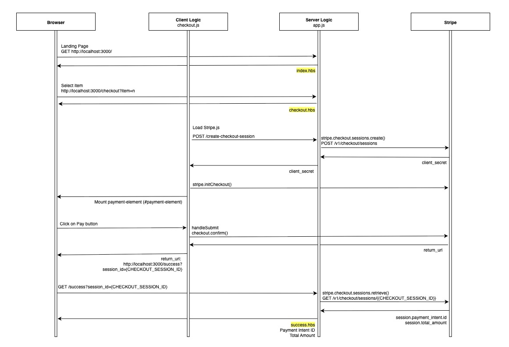

# Payment Element Boilerplate

## How to build, configure and run your application.

**1. Build**

Clone the repository and install dependencies

```
git clone https://github.com/jillianchi/jillian-payment-element
cd jillian-payment-element
npm install
```

<br>

**2. Configure**

- Rename `sample.env` to `.env` and populate with your Stripe account's test API keys

- Replace the hardcoded `STRIPE_PUBLISHABLE_KEY` on public/js/checkout.js (starting with `pk_`) with your Stripe account's test API key

<br>

**3. Run the application**

Start application locally:

```
npm start
```

Open [http://localhost:3000](http://localhost:3000) on your browser to view the index page
<br>
<br>

## How does the solution work? Which Stripe APIs does it use? How is your application architected?

**1. How does the solution work?**

The application leverages on Stripe Payment Elements - which seamlessly embeds a Stripe UI component onto the Checkout page. Everything inside this component is fully hosted by Stripe - which means as a merchant I do not need to be plagued by the

(i) complexity of building and maintaining payment UI,\
 (ii) burden of PCI-DSS compliance, and\
 (iii) management of security and fraud detection

<br>

**2. Which Stripe APIs does it use?**

I'm looking for a simple and fuss-free solution hence I went for the Checkout Session API - no extra logic or validation required from my end.

My checkout flow is supported by only two APIs - both implemented via the Stripe Node.js SDK on the server:

(i) Create a Checkout Session: POST /v1/checkout/sessions to start the payment\
(ii) Retrieve a Checkout Session: GET /v1/checkout/sessions/:id to check the payment status

<br>

**3. How is your application architected?**



<br>

**Server-side: app.js**

- Express app renders Handlebars templates (index.hbs, checkout.hbs, success.hbs)
- Integrates with the Stripe server SDK using `STRIPE_SECRET_KEY`
- Creates and retrieves Checkout Sessions via stripe.checkout.sessions.create and stripe.checkout.sessions.retrieve

  <br>

**Client-side: checkout.js**

- Browser loads Stripe.js with `STRIPE_PUBLISHABLE_KEY`
- The script fetches a Checkout Session client_secret from the server, initializes stripe.initCheckout(), mounts the Payment Element into the page, and calls checkout.confirm() when the user clicks Pay
- Stripe.js directly handles payment details, then redirects the browser to /success
  <br>
  <br>

## How did you approach this problem? Which docs did you use to complete the project? What challenges did you encounter?

**1. How did you approach this problem? Which docs did you use to complete the project?**

Since I am no developer the only possible way around this would be for me to stick to Stripe documentation as close as possible

**Step 1:** Google Stripe Payment Element\
Gives me all the context I need on this service\
https://docs.stripe.com/payments/payment-element

**Step 2:** Select from Compatible APIs on doc\
Simplicity is key - hence Checkout Sessions\
https://docs.stripe.com/payments/payment-element#compatible-apis

**Step 3:** Follow the Embedded Components guide step-by-step\
Keep as much as possible from project template (https://github.com/mattmitchell6/sa-takehome-project-node), adding in the key features required to get the embedded component running.

**Full disclaimer:** /public/js/checkout.js is literally taken wholesale from the documentation

<br>

**2. What challenges did you face?**

Honestly didn't think I was going to make it without AI since my development skills is close to null. It was also a race against time with my recent schedule - I had to convince myself to be okay with delivering the bare minimum

But thank goodness this is Stripe and the documentation lived up to its expectation so atleast I've got the basic requirements up and running. Living proof of how seamless a Stripe implementation can be - even for non-developers.
<br>
<br>

## How you might extend this if you were building a more robust instance of the same application.

A more robust instance can sit anywhere between the current application and a fully-fleged enterprise level e-commerce operation

First step would be to have catalog data stored in a database rather than hard-coded in the app - which can be retrieved via API.

To scale, key features can be isolated as microservices e.g.\
(i) Catalog manages product information\
(ii) Pricing and Inventory for product availability\
(iii) Logistics for shipping and fulfillment

With proper APIs in place for interaction between the services the operation can scale to leverage on enterprise systems e.g.\
(i) PIM (or a separate database) to manage catalog information\
(ii) ERP as the source oef truth for prices and inventory\
(iii) WMS to account for logictics and shipping rates
